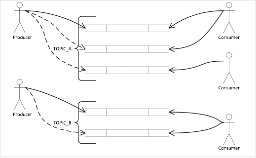
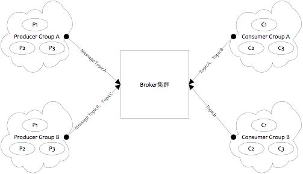
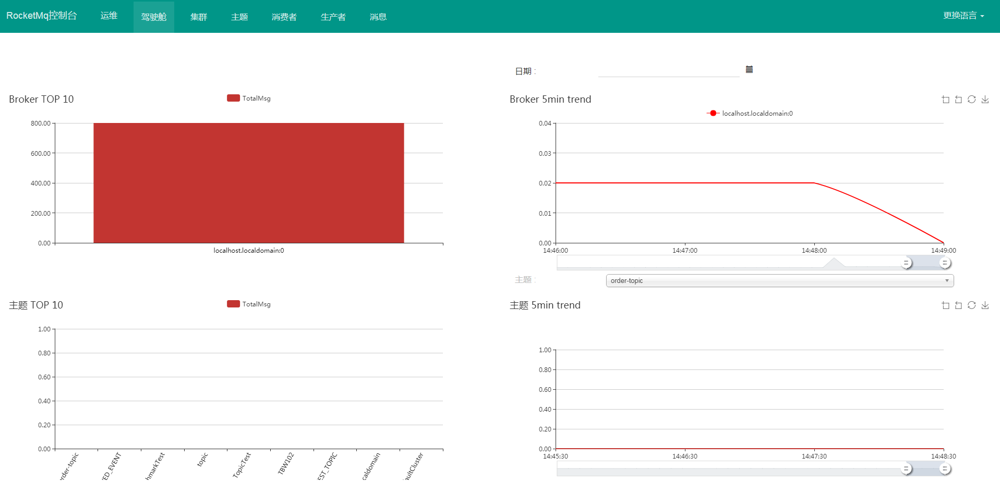

### Rocketmq是什么？

<!-- more -->



- 是一个队列模型的消息中间件，具有高性能、高可靠、高实时、分布式特点
- Producer、Consumer、队列都可以分布式
- Producer向一些队列轮流发送消息，队列集合称为Topic，Consumer如果做广播消费，则一个consumer实例消费这个Topic对应的所有队列，如果做集群消费，则多个Consumer实例平均消费这个topic对应的队列集合
- 能够保证严格的消息顺序
- 提供丰富的消息拉取模式
- 高效的订阅者水平扩展能力
- 实时的消息订阅机制
- 亿级消息堆积能力
- 较少的依赖

### rocketmq部署物理结构


**rocketmq部署结构特点：**
- Name Server是一个几乎无状态节点，可集群部署，节点之间无任何信息同步。
- Broker部署相对复杂，Broker分为Master与Slave，一个Master可以对应多个Slave，但是一个Slave只能对应一个Master。Master可以部署多个，每个Broker与Name Server集群中的所有节点建立长连接，定时注册Topic信息到所有Name Server。
- Producer与Name Server集群中的其中一个节点（随机选择）建立长连接，定期从Name Server取Topic路由信息，并向提供Topic服务的Master建立长连接，且定时向Master发送心跳。Producer完全无状态，可集群部署。
- Consumer与Name Server集群中的其中一个节点（随机选择）建立长连接，定期从Name Server取Topic路由信息，并向提供Topic服务的Master、Slave建立长连接，且定时向Master、Slave发送心跳。Consumer既可以从Master订阅消息，也可以从Slave订阅消息，订阅规则由Broker配置决定。

### Rocketmq逻辑部署结构



**rocketmq启动停止命令**
```
nohup sh bin/mqnamesrv &       启动name服务
sh bin/mqshutdown broker       关闭name服务

nohup sh bin/mqbroker -n localhost:9876 &  启动broker服务
sh bin/mqshutdown namesrv      关闭broker服务
```

### Rocketmq使用示例

#### 生产者消费者示例

```
public void processor() throws Exception {
    DefaultMQProducer producer = new DefaultMQProducer("ProducerGroupName");
    producer.setNamesrvAddr("192.168.236.129:9876");
    producer.setInstanceName("Producer");
    producer.start();
 
    for (int i = 0; i < 10; i++) {
        Message message = new Message("topic", ("hello world" + i).getBytes());
        System.out.println(producer.send(message));
    }
 
    producer.shutdown();
}

public void consumer() throws Exception {
    DefaultMQPushConsumer consumer = new DefaultMQPushConsumer("ConsumerGroupName");
    consumer.setNamesrvAddr("192.168.236.129:9876");
    consumer.setInstanceName("Consumer");
    consumer.subscribe("topic", "*");
 
    // 注册监听
    consumer.registerMessageListener((MessageListenerConcurrently) (list, consumeConcurrentlyContext) -> {
 
        list.forEach(msgExt -> System.out.println(new String(msgExt.getBody())));
        return ConsumeConcurrentlyStatus.CONSUME_SUCCESS;
    });
 
    consumer.start();
}
```

注意，消费者使用push模式，也就是通过注册listener然后回调方式来消费消息。生产者使用的同步模式，rocketmq有3种消息发送模式：可靠地同步、可靠地异步和单向传输。

可靠的同步模式应用场景较广泛，比如消息通知、短信通知、营销通知等场景。
可靠的异步模式通常应用于对响应时间较敏感的业务场景。
单向传输通常应用于中等可靠性场景，比如日志收集。
3种场景的示例代码可参考：http://rocketmq.apache.org/docs/simple-example/ 。

**发送定时消息**

目前rocketmq只支持固定时间精度级别的定时消息，按照1-N定义了如下级别： “1s 5s 10s 30s 1m 2m 3m 4m 5m 6m 7m 8m 9m 10m 20m 30m 1h 2h”。若要发送定时消息，在应用层初始化Message消息对象之后，调用`Message.setDelayTimeLevel(int level)`方法来设置延迟级别，按照序列取相应的延迟级别，例如level=2，则延迟为5s，也就是说5s之后Consumer才能消费该消息。

####  顺序消息、重复消息

顺序消息的保证不仅仅依赖消息系统，也需要业务系统来保证。针对顺序消息，消息系统保证队列中消息按照FIFO顺序处理，一个队列中的所有消息由一个消费线程处理；业务系统保证消息按照顺序发送给消息系统中topic下的同一个队列中。

rocketmq默认使用轮询方式将消息发送给topic下的所有队列，使用顺序消息，则需要将顺序消息发送给同一个队列。下面示例是相同订单号的消息会被先后发送给同一个队列：
```
// RocketMQ通过MessageQueueSelector中实现的算法来确定消息发送到哪一个队列上
// RocketMQ默认提供了两种MessageQueueSelector实现：随机/Hash
// 当然你可以根据业务实现自己的MessageQueueSelector来决定消息按照何种策略发送到消息队列中
SendResult sendResult = producer.send(msg, new MessageQueueSelector() {
    @Override
    public MessageQueue select(List<MessageQueue> mqs, Message msg, Object arg) {
        Integer id = (Integer) arg;
        int index = id % mqs.size();
        return mqs.get(index);
    }
}, orderId);
```

顺序消息的问题解决了，不过还存在重复消息的问题。对于重复问题，既可以在mq中来去重，也可以在业务系统中来去重。如果在mq中去重的话，肯定会影响mq的性能，并且去重并不是消息系统要提供的主要功能，如果业务系统就需要重复消息，那么mq做了去重岂不是尴尬了。所以，**RocketMQ不保证消息不重复，如果业务需要保证严格的不重复消息，需要自己在业务端去重**。

### Rocketmq-console web管理平台

rocketmq目前有自己的web管理平台，项目地址为：https://github.com/apache/rocketmq-externals/tree/master/rocketmq-console ，rocketmq-externals是rocketmq相关的一系列工具集合项目。rocketmq-console基于spring-boot开发。

使用方法：
1、下载rocketmq-console工程，执行mvn package命令。
2、然后执行java -jar rocketmq-console-ng-1.0.0.jar命令即可，namesrv配置信息在application.properties。在application.properties文件中配置port和namesrv地址，注意，如果rocketmq version是3.5.8之前的，需要设置rocketmq.config.isVIPChannel为false，因为rocketmq.config.isVIPChannel默认为true。VIPChannel对应的是broker port为10909。

web管理界面如下所示：


### 消息中间件需要解决的问题

#### Message Priority

规范中描述的优先级是指在一个消息队列中，每条消息都有不同的优先级，一般用整数来描述，优先级高的消息先投递，如果消息完全在一个内存队列中，那么在投递前可以按照优先级排序，令优先级高的先投递。
由于RocketMQ所有消息都是（按照接收顺序进行）持久化的，所以如果按照优先级来排序，开销会非常大，因此RocketMQ没有特意支持消息优先级，但是可以通过变通的方式实现类似功能，即单独配置一个优先级高的队列，和一个普通优先级的队列， 将不同优先级发送到不同队列即可。

对于优先级问题，可以归纳为2类：
1. 只要达到优先级目的即可，不是严格意义上的优先级，通常将优先级划分为高、中、低，或者再多几个级别。每个优先级可以用不同的topic表示，发消息时，指定不同的topic来表示优先级，这种方式可以解决绝大部分的优先级问题，但是对业务的优先级精确性做了妥协。
2. 严格的优先级，优先级用整数表示，例如0 ~ 65535，这种优先级问题一般使用不同topic解决就非常不合适。如果要让MQ解决此问题，会对MQ的性能造成非常大的影响。这里要确保一点，业务上是否确实需要这种严格的优先级，如果将优先级压缩成几个，对业务的影响有多大？

#### Message Order

消息有序指的是一类消息消费时，能按照发送的顺序来消费。例如：一个订单产生了3条消息，分别是订单创建，订单付款，订单完成。消费时，要按照这个顺序消费才能有意义。但是同时订单之间是可以并行消费的。RocketMQ可以严格的保证消息有序，这需要使用者将需要保证顺序的消息写入到同一个queue，然后消费时从该queue依次进行消费即可。

#### Message Filter

Broker端消息过滤，在Broker中，按照Consumer的要求做过滤，优点是减少了对于Consumer无用消息的网络传输。缺点是增加了Broker的负担，实现相对复杂。

- 淘宝Notify支持多种过滤方式，包含直接按照消息类型过滤，灵活的语法表达式过滤，几乎可以满足最苛刻的过滤需求。
- 淘宝RocketMQ支持按照简单的Message Tag过滤，也支持按照Message Header、body进行过滤。
- CORBA Notification规范中也支持灵活的语法表达式过滤。

Consumer端消息过滤，这种过滤方式可由应用完全自定义实现，但是缺点是很多无用的消息要传输到Consumer端。

#### Message Persistence

消息中间件通常采用的几种持久化方式：

1. 持久化到数据库，例如Mysql。
2. 持久化到KV存储，例如levelDB、伯克利DB等KV存储系统。
3. 文件记录形式持久化，例如Kafka，RocketMQ
4. 对内存数据做一个持久化镜像，例如beanstalkd，VisiNotify

(1)、(2)、(3)三种持久化方式都具有将内存队列Buffer进行扩展的能力，(4)只是一个内存的镜像，作用是当Broker挂掉重启后仍然能将之前内存的数据恢复出来。JMS与CORBA Notification规范没有明确说明如何持久化，但是持久化部分的性能直接决定了整个消息中间件的性能。
RocketMQ充分利用Linux文件系统内存cache来提高性能，能做到大多数消息直接与page cache交互。（Linux下建议使用ext4提高持久化性能）

#### Message Reliablity

影响消息可靠性的几种情况：

1. Broker正常关闭
2. Broker异常Crash
3. OS Crash
4. 机器掉电，但是能立即恢复供电情况。
5. 机器无法开机（可能是cpu、主板、内存等关键设备损坏）
6. 磁盘设备损坏。

(1)、(2)、(3)、(4)四种情况都属于硬件资源可立即恢复情况，RocketMQ在这四种情况下能保证消息不丢，或者丢失少量数据（依赖刷盘方式是同步还是异步）。
(5)、(6)属于单点故障，且无法恢复，一旦发生，在此单点上的消息全部丢失。RocketMQ在这两种情况下，通过异步复制，可保证99%的消息不丢，但是仍然会有极少量的消息可能丢失。通过同步双写技术可以完全避免单点，同步双写势必会影响性能，适合对消息可靠性要求极高的场合，例如与Money相关的应用。

RocketMQ从3.0版本开始支持同步双写。

#### Low Latency Messaging

在消息不堆积情况下，消息到达Broker后，能立刻到达Consumer。RocketMQ使用长轮询Pull方式，可保证消息非常实时，消息实时性不低于Push。

在没有消息达到时，Broker接收到Consumer的PullRequest不是立即返回的，而是等待一段时间，如果该段时间内有消息来临则直接返回，否则等到超时后再返回。这样减少了不必要的网络通信，提高了处理性能。

#### At least Once

是指每个消息必须投递一次。
RocketMQ Consumer先pull消息到本地，消费完成后，才向服务器返回ack，如果没有消费一定不会ack消息，所以RocketMQ可以很好的支持此特性。

#### Exactly Only Once

发送消息阶段，不允许发送重复的消息。
消费消息阶段，不允许消费重复的消息。
只有以上两个条件都满足情况下，才能认为消息是“Exactly Only Once”，而要实现以上两点，在分布式系统环境下，不可避免要产生巨大的开销。所以RocketMQ为了追求高性能，并不保证此特性，要求在业务上进行去重，也就是说消费消息要做到幂等性。RocketMQ虽然不能严格保证不重复，但是正常情况下很少会出现重复发送、消费情况，只有网络异常，Consumer启停等异常情况下会出现消息重复。

#### Broker的Buffer满了怎么办？

Broker的Buffer通常指的是Broker中一个队列的内存Buffer大小，这类Buffer通常大小有限，如果Buffer满了以后怎么办？
下面是CORBA Notification规范中处理方式：

1. RejectNewEvents 拒绝新来的消息，向Producer返回RejectNewEvents错误码。
2. 按照特定策略丢弃已有消息
	- AnyOrder - Any event may be discarded on overflow. This is the default setting for this property.
	- FifoOrder - The first event received will be the first discarded.
	- LifoOrder - The last event received will be the first discarded.
	- PriorityOrder - Events should be discarded in priority order, such that lower priority events will be discarded before higher priority events.
	- DeadlineOrder - Events should be discarded in the order of shortest expiry deadline first.
	- RocketMQ没有内存Buffer概念，RocketMQ的队列都是持久化磁盘，数据定期清除。

对于此问题的解决思路，RocketMQ同其他MQ有非常显著的区别，RocketMQ的内存Buffer抽象成一个无限长度的队列，不管有多少数据进来都能装得下，这个无限是有前提的，Broker会定期删除过期的数据，例如Broker只保存3天的消息，那么这个Buffer虽然长度无限，但是3天前的数据会被从队尾删除。

#### 回溯消费

回溯消费是指Consumer已经消费成功的消息，由于业务上需求需要重新消费，要支持此功能，Broker在向Consumer投递成功消息后，消息仍然需要保留。并且重新消费一般是按照时间维度，例如由于Consumer系统故障，恢复后需要重新消费1小时前的数据，那么Broker要提供一种机制，可以按照时间维度来回退消费进度。
RocketMQ支持按照时间回溯消费，时间维度精确到毫秒，可以向前回溯，也可以向后回溯。

#### 消息堆积

消息中间件的主要功能是异步解耦，还有个重要功能是挡住前端的数据洪峰，保证后端系统的稳定性，这就要求消息中间件具有一定的消息堆积能力，消息堆积分以下两种情况：

1. 消息堆积在内存Buffer，一旦超过内存Buffer，可以根据一定的丢弃策略来丢弃消息，如CORBA Notification规范中描述。适合能容忍丢弃消息的业务，这种情况消息的堆积能力主要在于内存Buffer大小，而且消息堆积后，性能下降不会太大，因为内存中数据多少对于对外提供的访问能力影响有限。
2. 消息堆积到持久化存储系统中，例如DB，KV存储，文件记录形式。 当消息不能在内存Cache命中时，要不可避免的访问磁盘，会产生大量读IO，读IO的吞吐量直接决定了消息堆积后的访问能力。

评估消息堆积能力主要有以下四点：
- 消息能堆积多少条，多少字节？即消息的堆积容量。
- 消息堆积后，发消息的吞吐量大小，是否会受堆积影响？
- 消息堆积后，正常消费的Consumer是否会受影响？
- 消息堆积后，访问堆积在磁盘的消息时，吞吐量有多大？

#### 消息重试

Consumer消费消息失败后，要提供一种重试机制，令消息再消费一次。Consumer消费消息失败通常可以认为有以下几种情况：

- 由于消息本身的原因，例如反序列化失败，消息数据本身无法处理（例如话费充值，当前消息的手机号被注销，无法充值）等。这种错误通常需要跳过这条消息，再消费其他消息，而这条失败的消息即使立刻重试消费，99%也不成功，所以最好提供一种定时重试机制，即过10s秒后再重试。
- 由于依赖的下游应用服务不可用，例如db连接不可用，外系统网络不可达等。遇到这种错误，即使跳过当前失败的消息，消费其他消息同样也会报错。这种情况建议应用sleep 30s，再消费下一条消息，这样可以减轻Broker重试消息的压力。

参考资料：
1、http://jm.taobao.org/2017/01/12/rocketmq-quick-start-in-10-minutes/
2、http://rocketmq.apache.org/docs/quick-start/