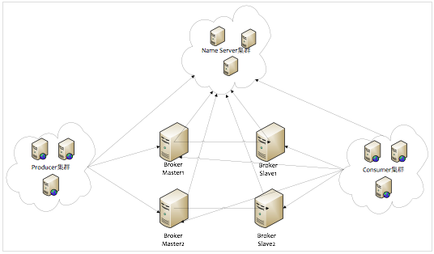
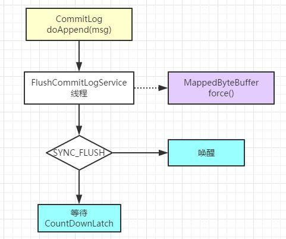
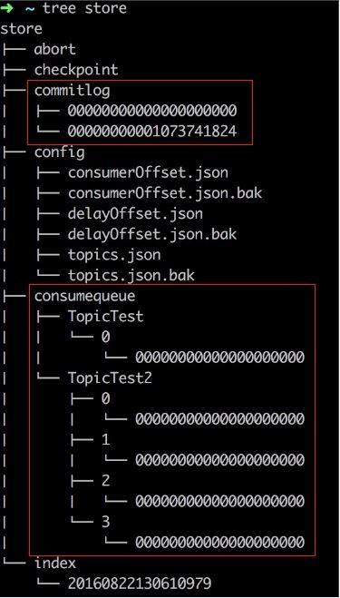

在分析Broker之前，首先要知道Broker在Rocketmq架构中所处的位置，也就是下图中的**Broker集群**。

<!-- more -->
	


## CommitLog文件

broker接收到的消息会保存在CommitLog中，CommitLog是保存消息元数据的地方，broker接收到所有Topic的消息，都会按照顺序，并且以固定的格式存储到CommitLog中。例如，当前集群中有2个topic，分别是topicA和topicB，这两个topic的消息会按照先后到达的顺序保存到同一个commigLog中，而不是每个Topic都有一个独立的commitLog。与rocketmq不同的是，kafka中会对每个topic都维护专门的commitLog。

broker中的所有消息都是存储到commitLog中的，那么如何保证高并发的消息读写呢？这里broker主要是利用了Linux系统的PageCache特性，通过Java的MappedByteBuffer直接操作PageCache。MappedByteBuffer能够将文件映射到内存中，其实就是通过mmap系统调用将文件的内容映射到虚拟内存中的一块区域，这样就可以通过该内存区域对文件进行读写操作，而不是每次都通过I/O去物理硬盘读写文件。

每个commitLog文件的上限是1G，满1G时会创建新的commitLog文件来保存消息。消息存储到CommitLog文件（消息文件），那么就有一个问题了，CommitLog文件删不删以及什么时候删除？消息存储在CommitLog之后，是会被清理的，但是这个清理只会在以下任一条件成立才会批量删除消息文件（CommitLog）：
  1. 消息文件过期（默认72小时），且到达清理时点（默认是凌晨4点），删除过期文件。
  2. 消息文件过期（默认72小时），且磁盘空间达到了水位线（默认75%），删除过期文件。
  3. 磁盘已经达到必须释放的上限（85%水位线）的时候，则开始批量清理文件（无论是否过期），直到空间充足。

通过CommitLog和MappedByteBuffer（结合PageCache），保证了rocketmq高效的消息读写性能。所有Topic消息写入同一个CommitLog，也避免了在大量Topic存在情况下读写IO引发的性能问题（相比于每个topic对应一个文件方式的情况）。

直接读写文件内存映射区域的数据，提高了系统的吞吐量，但是无法避免掉电数据丢失问题，所以需要持久化到磁盘中。刷盘的最终实现都是使用NIO中的 MappedByteBuffer.force() 将映射区的数据写入到磁盘，如果是同步刷盘的话，在Broker把消息写到CommitLog映射区后，就会等待写入完成。异步而言，只是唤醒对应的线程，不保证执行的时机。刷盘实现请[点击](https://blog.csdn.net/vonzhoufz/article/details/47248777)。



broker在写消息按照**顺序写**CommitLog，读消息时是**跳跃读**CommitLog。broker读取消息依赖系统PageCache，PageCache命中率越高，读性能越高，Linux平时也会尽量预读数据，使得应用直接访问磁盘的概率降低。如果读取PageCache未命中，则会触发缺页中断，系统从磁盘中读取对应的数据页，并且系统还会将该数据页之后的连续几页也一并读入到cache中，再将应用需要的数据返回。

## rocketmq的存储架构

commitLog的存储路径是${user.home}/store/commitlog/${fileName}，目录store存储结构如下：



commitlog文件名长度为20，第一个文件命名为000..000，第二个文件名表示当前文件偏移量，也就是00..01073741824（1G），后面的文件以此类推。

rocketmq的存储架构特点：
1. 消息元数据及主体存储在commitLog文件中。
2. consumeQueue相当于kafka中的parition，是一个逻辑队列，存储了这个Queue在CommiLog中的起始offset，log大小和MessageTag的hashCode。
3. 每次读取消息队列先读取consumerQueue，然后再通过consumerQueue去commitLog中读取消息主体数据。
  
rocketmq为什么要这样设计呢，首先rocketmq设计理念参考了kafka，这里就要提一下kafka的存储结构设计，和RocketMQ类似，每个Topic有多个partition(queue),kafka的每个partition都是一个独立的物理文件，消息直接从里面读写。根据之前阿里中间件团队的测试，一旦kafka中Topic的partitoin数量过多，队列文件会过多，会给磁盘的IO读写造成很大的压力，造成TPS迅速下降。

所以RocketMQ进行了上述这样设计，consumerQueue中只存储很少的数据，消息主体都是通过CommitLog来进行读写。借用大牛的一句话来说，没有一种方案是银弹，rocketmq这样设计有哪些优缺点呢？  

**优点**
队列轻量化，单个队列数据量非常少，消息主体都存在commitLog。对磁盘的访问串行化，避免磁盘竟争，不会因为队列增加导致IOWAIT增高。

**缺点**
写虽然完全是顺序写，但是读却变成了完全的随机读。读一条消息，会先读ConsumeQueue，再读CommitLog，增加了开销。 要保证CommitLog与ConsumeQueue完全的一致，增加了编程的复杂度。

以上缺点rocketmq是如何克服的呢？随机读，尽量命中pageCache，减少IO操作，因此消息量大时rocketmq的内存越大越好。由于consumerQueue文件存储的数据量较小，而且是顺序读，因此在pageCache预读情况下，consumerQueue文件读性能几乎和内存一样，即使在消息堆积的情况下，consumerQueue也不会成为读消息的瓶颈。

## 消息堆积

消息中间件的主要功能就是异步解耦，还有个重要的功能是挡住数据洪峰，保证后端系统稳定性，这就要求消息系统有一定的数据堆积能力。消息数据堆积分为以下2种情况：

（1） 消息堆积在内存Buffer，一旦超过了内存Buffer，则根据一定的策略丢弃消息，如 CORBA Notification规范中描述。适合能容忍丢弃消息的业务，这种情况消息的堆积能力主要在于内存 Buffer 大小，而且消息堆积后，性能下降不会太大，因为内存中数据多少对于对外提供的访问能力影响有限。
（2） 消息堆积到持久化存储系统中，例如 DB，KV 存储，文件记录形式。当消息不能在内存 Cache 命中时，要不可避免的访问磁盘，会产生大量读 IO，读 IO 的吞吐量直接决定了消息堆积后的访问能力。

### Consumer从Broker拉取消息

Broker端执行消息拉取的处理器是PullMessageProcessor，在BrokerController构造方法中会创建PullMessageProcessor实例，在registerProcessor方法中会注册PULL_MESSAGE消息对应的处理器，也就是PullMessageProcessor实例。（PULL_MESSAGE消息是Consumer端从Broker拉取消息类型，PullMessageProcessor负责对Consumer拉取消息请求作出回应）

```
// BrokerController.initialize
public void registerProcessor() {
    /**
     * SendMessageProcessor
     */
    SendMessageProcessor sendProcessor = new SendMessageProcessor(this);
    sendProcessor.registerSendMessageHook(sendMessageHookList);
    sendProcessor.registerConsumeMessageHook(consumeMessageHookList);
 
    this.remotingServer.registerProcessor(RequestCode.SEND_MESSAGE, sendProcessor, this.sendMessageExecutor);
    this.remotingServer.registerProcessor(RequestCode.SEND_MESSAGE_V2, sendProcessor, this.sendMessageExecutor);
    this.remotingServer.registerProcessor(RequestCode.SEND_BATCH_MESSAGE, sendProcessor, this.sendMessageExecutor);
    this.remotingServer.registerProcessor(RequestCode.CONSUMER_SEND_MSG_BACK, sendProcessor, this.sendMessageExecutor);
    this.fastRemotingServer.registerProcessor(RequestCode.SEND_MESSAGE, sendProcessor, this.sendMessageExecutor);
    this.fastRemotingServer.registerProcessor(RequestCode.SEND_MESSAGE_V2, sendProcessor, this.sendMessageExecutor);
    this.fastRemotingServer.registerProcessor(RequestCode.SEND_BATCH_MESSAGE, sendProcessor, this.sendMessageExecutor);
    this.fastRemotingServer.registerProcessor(RequestCode.CONSUMER_SEND_MSG_BACK, sendProcessor, this.sendMessageExecutor);
    /**
     * PullMessageProcessor
     */
    this.remotingServer.registerProcessor(RequestCode.PULL_MESSAGE, this.pullMessageProcessor, this.pullMessageExecutor);
    this.pullMessageProcessor.registerConsumeMessageHook(consumeMessageHookList);
    //...
}
```

当Broker接收到PULL_MESSAGE消息时，会调用**processRequest方法**对其进行处理。

```
// PullMessageProcessor
@Override
public RemotingCommand processRequest(final ChannelHandlerContext ctx,
    RemotingCommand request) throws RemotingCommandException {
    System.out.println(Thread.currentThread().getName() + ": PullMessageProcessor processRequest");
    return this.processRequest(ctx.channel(), request, true);
}
 
private RemotingCommand processRequest(final Channel channel, RemotingCommand request, boolean brokerAllowSuspend)
    throws RemotingCommandException {
    // 首先构造response，设置opaque等信息
    RemotingCommand response = RemotingCommand.createResponseCommand(PullMessageResponseHeader.class);
    final PullMessageResponseHeader responseHeader = (PullMessageResponseHeader) response.readCustomHeader();
    final PullMessageRequestHeader requestHeader =
        (PullMessageRequestHeader) request.decodeCommandCustomHeader(PullMessageRequestHeader.class);
 
    response.setOpaque(request.getOpaque());
    //...
    // 是否能延迟响应消息
    final boolean hasSuspendFlag = PullSysFlag.hasSuspendFlag(requestHeader.getSysFlag());
    final boolean hasCommitOffsetFlag = PullSysFlag.hasCommitOffsetFlag(requestHeader.getSysFlag());
    final boolean hasSubscriptionFlag = PullSysFlag.hasSubscriptionFlag(requestHeader.getSysFlag());
 
    final long suspendTimeoutMillisLong = hasSuspendFlag ? requestHeader.getSuspendTimeoutMillis() : 0;
    //...
    // 查找topic下queue中消息
    final GetMessageResult getMessageResult =
        this.brokerController.getMessageStore().getMessage(requestHeader.getConsumerGroup(), requestHeader.getTopic(),
            requestHeader.getQueueId(), requestHeader.getQueueOffset(), requestHeader.getMaxMsgNums(), messageFilter);
    if (getMessageResult != null) {
        response.setRemark(getMessageResult.getStatus().name());
        responseHeader.setNextBeginOffset(getMessageResult.getNextBeginOffset());
        responseHeader.setMinOffset(getMessageResult.getMinOffset());
        responseHeader.setMaxOffset(getMessageResult.getMaxOffset());
        //...
        switch (getMessageResult.getStatus()) {
            case FOUND:
                response.setCode(ResponseCode.SUCCESS);
                break;
            case MESSAGE_WAS_REMOVING:
                response.setCode(ResponseCode.PULL_RETRY_IMMEDIATELY);
                break;
            case NO_MATCHED_LOGIC_QUEUE:
            case NO_MESSAGE_IN_QUEUE:
                if (0 != requestHeader.getQueueOffset()) {
                    response.setCode(ResponseCode.PULL_OFFSET_MOVED);
 
                    // XXX: warn and notify me
                    log.info("the broker store no queue data, fix the request offset {} to {}, Topic: {} QueueId: {} Consumer Group: {}",
                        requestHeader.getQueueOffset(),
                        getMessageResult.getNextBeginOffset(),
                        requestHeader.getTopic(),
                        requestHeader.getQueueId(),
                        requestHeader.getConsumerGroup()
                    );
                } else {
                    response.setCode(ResponseCode.PULL_NOT_FOUND);
                }
                break;
            case NO_MATCHED_MESSAGE:
                response.setCode(ResponseCode.PULL_RETRY_IMMEDIATELY);
                break;
            case OFFSET_FOUND_NULL:
                response.setCode(ResponseCode.PULL_NOT_FOUND);
                break;
            case OFFSET_OVERFLOW_BADLY:
                response.setCode(ResponseCode.PULL_OFFSET_MOVED);
                break;
            case OFFSET_OVERFLOW_ONE:
                response.setCode(ResponseCode.PULL_NOT_FOUND);
                break;
            case OFFSET_TOO_SMALL:
                response.setCode(ResponseCode.PULL_OFFSET_MOVED);
                break;
            default:
                assert false;
                break;
        }
 
        switch (response.getCode()) {
            case ResponseCode.SUCCESS:
                // 找到消息后返回
                this.brokerController.getBrokerStatsManager().incGroupGetNums(requestHeader.getConsumerGroup(), requestHeader.getTopic(),
                    getMessageResult.getMessageCount());
 
                this.brokerController.getBrokerStatsManager().incGroupGetSize(requestHeader.getConsumerGroup(), requestHeader.getTopic(),
                    getMessageResult.getBufferTotalSize());
 
                this.brokerController.getBrokerStatsManager().incBrokerGetNums(getMessageResult.getMessageCount());
                if (this.brokerController.getBrokerConfig().isTransferMsgByHeap()) {
                    final long beginTimeMills = this.brokerController.getMessageStore().now();
                    final byte[] r = this.readGetMessageResult(getMessageResult, requestHeader.getConsumerGroup(), requestHeader.getTopic(), requestHeader.getQueueId());
                    this.brokerController.getBrokerStatsManager().incGroupGetLatency(requestHeader.getConsumerGroup(),
                        requestHeader.getTopic(), requestHeader.getQueueId(),
                        (int) (this.brokerController.getMessageStore().now() - beginTimeMills));
                    response.setBody(r);
                } else {
                    try {
                        FileRegion fileRegion =
                            new ManyMessageTransfer(response.encodeHeader(getMessageResult.getBufferTotalSize()), getMessageResult);
                        channel.writeAndFlush(fileRegion).addListener(new ChannelFutureListener() {
                            @Override
                            public void operationComplete(ChannelFuture future) throws Exception {
                                getMessageResult.release();
                                if (!future.isSuccess()) {
                                    log.error("transfer many message by pagecache failed, {}", channel.remoteAddress(), future.cause());
                                }
                            }
                        });
                    } catch (Throwable e) {
                        log.error("transfer many message by pagecache exception", e);
                        getMessageResult.release();
                    }
 
                    response = null;
                }
                break;
            case ResponseCode.PULL_NOT_FOUND:
                // 未找到消息时如果能够延迟返回则延迟响应
                if (brokerAllowSuspend && hasSuspendFlag) {
                    long pollingTimeMills = suspendTimeoutMillisLong;
                    if (!this.brokerController.getBrokerConfig().isLongPollingEnable()) {
                        pollingTimeMills = this.brokerController.getBrokerConfig().getShortPollingTimeMills();
                    }
 
                    String topic = requestHeader.getTopic();
                    long offset = requestHeader.getQueueOffset();
                    int queueId = requestHeader.getQueueId();
                    PullRequest pullRequest = new PullRequest(request, channel, pollingTimeMills,
                        this.brokerController.getMessageStore().now(), offset, subscriptionData, messageFilter);
                    this.brokerController.getPullRequestHoldService().suspendPullRequest(topic, queueId, pullRequest);
                    response = null;
                    break;
                }
 
            case ResponseCode.PULL_RETRY_IMMEDIATELY:
                break;
            case ResponseCode.PULL_OFFSET_MOVED:
                if (this.brokerController.getMessageStoreConfig().getBrokerRole() != BrokerRole.SLAVE
                    || this.brokerController.getMessageStoreConfig().isOffsetCheckInSlave()) {
                    MessageQueue mq = new MessageQueue();
                    mq.setTopic(requestHeader.getTopic());
                    mq.setQueueId(requestHeader.getQueueId());
                    mq.setBrokerName(this.brokerController.getBrokerConfig().getBrokerName());
 
                    OffsetMovedEvent event = new OffsetMovedEvent();
                    event.setConsumerGroup(requestHeader.getConsumerGroup());
                    event.setMessageQueue(mq);
                    event.setOffsetRequest(requestHeader.getQueueOffset());
                    event.setOffsetNew(getMessageResult.getNextBeginOffset());
                    this.generateOffsetMovedEvent(event);
                } else {
                    responseHeader.setSuggestWhichBrokerId(subscriptionGroupConfig.getBrokerId());
                    response.setCode(ResponseCode.PULL_RETRY_IMMEDIATELY);
                }
 
                break;
            default:
                assert false;
        }
    } else {
        response.setCode(ResponseCode.SYSTEM_ERROR);
        response.setRemark("store getMessage return null");
    }
 
    boolean storeOffsetEnable = brokerAllowSuspend;
    storeOffsetEnable = storeOffsetEnable && hasCommitOffsetFlag;
    storeOffsetEnable = storeOffsetEnable
        && this.brokerController.getMessageStoreConfig().getBrokerRole() != BrokerRole.SLAVE;
    if (storeOffsetEnable) {
        this.brokerController.getConsumerOffsetManager().commitOffset(RemotingHelper.parseChannelRemoteAddr(channel),
            requestHeader.getConsumerGroup(), requestHeader.getTopic(), requestHeader.getQueueId(), requestHeader.getCommitOffset());
    }
    return response;
}
```

延时请求会传递给PullRequestHoldService，PullRequestHoldService是一个线程，在其run方法中，会sleep一定时间，然后调用this.checkHoldRequest()检查所有被hold的延时请求，调用notifyMessageArriving通知是否有消息到达。

```
public void notifyMessageArriving(final String topic, final int queueId, final long maxOffset) {
    notifyMessageArriving(topic, queueId, maxOffset, null, 0, null, null);
}
 
public void notifyMessageArriving(final String topic, final int queueId, final long maxOffset, final Long tagsCode,
    long msgStoreTime, byte[] filterBitMap, Map<String, String> properties) {
    String key = this.buildKey(topic, queueId);
    ManyPullRequest mpr = this.pullRequestTable.get(key);
    if (mpr != null) {
        List<PullRequest> requestList = mpr.cloneListAndClear();
        if (requestList != null) {
            List<PullRequest> replayList = new ArrayList<PullRequest>();
 
            for (PullRequest request : requestList) {
                long newestOffset = maxOffset;
                if (newestOffset <= request.getPullFromThisOffset()) {
                    newestOffset = this.brokerController.getMessageStore().getMaxOffsetInQueue(topic, queueId);
                }
 
                if (newestOffset > request.getPullFromThisOffset()) {
                    boolean match = request.getMessageFilter().isMatchedByConsumeQueue(tagsCode,
                        new ConsumeQueueExt.CqExtUnit(tagsCode, msgStoreTime, filterBitMap));
                    // match by bit map, need eval again when properties is not null.
                    if (match && properties != null) {
                        match = request.getMessageFilter().isMatchedByCommitLog(null, properties);
                    }
 
                    if (match) {
                        try {
                            this.brokerController.getPullMessageProcessor().executeRequestWhenWakeup(request.getClientChannel(),
                                request.getRequestCommand());
                        } catch (Throwable e) {
                            log.error("execute request when wakeup failed.", e);
                        }
                        continue;
                    }
                }
 
                if (System.currentTimeMillis() >= (request.getSuspendTimestamp() + request.getTimeoutMillis())) {
                    try {
                        this.brokerController.getPullMessageProcessor().executeRequestWhenWakeup(request.getClientChannel(),
                            request.getRequestCommand());
                    } catch (Throwable e) {
                        log.error("execute request when wakeup failed.", e);
                    }
                    continue;
                }
 
                replayList.add(request);
            }
 
            if (!replayList.isEmpty()) {
                mpr.addPullRequest(replayList);
            }
        }
    }
}
 
// 因为PullRequestHoldService是单线程的，所有查询topic消息和对pull请求做出响应是submit给另外的线程来做的
public void executeRequestWhenWakeup(final Channel channel,
    final RemotingCommand request) throws RemotingCommandException {
    Runnable run = new Runnable() {
        @Override
        public void run() {
            try {
                final RemotingCommand response = PullMessageProcessor.this.processRequest(channel, request, false);
 
                if (response != null) {
                    response.setOpaque(request.getOpaque());
                    response.markResponseType();
                    try {
                        channel.writeAndFlush(response).addListener(new ChannelFutureListener() {
                            @Override
                            public void operationComplete(ChannelFuture future) throws Exception {
                                if (!future.isSuccess()) {
                                    log.error("processRequestWrapper response to {} failed",
                                        future.channel().remoteAddress(), future.cause());
                                    log.error(request.toString());
                                    log.error(response.toString());
                                }
                            }
                        });
                    } catch (Throwable e) {
                        log.error("processRequestWrapper process request over, but response failed", e);
                        log.error(request.toString());
                        log.error(response.toString());
                    }
                }
            } catch (RemotingCommandException e1) {
                log.error("excuteRequestWhenWakeup run", e1);
            }
        }
    };
    this.brokerController.getPullMessageExecutor().submit(new RequestTask(run, channel, request));
}
```

因为调用processRequest(channel, request, false)时传递的brokerAllowSuspend为false，所以会对pull请求立即做出响应，也就是延迟对pull的处理在这里肯定会结束的。