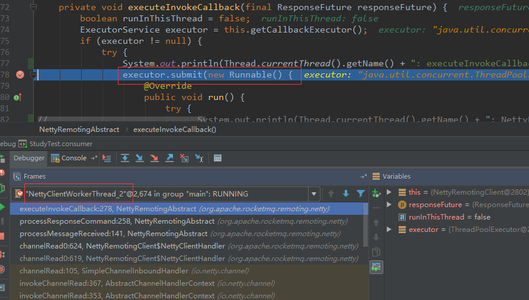

在分析Consumer端之前，首先要知道Consumer在Rocketmq架构中所处的位置，也就是下图中的**Consumer集群**。

<!-- more -->


了解了Consumer的架构部署，下面我们以问题驱动的方式来逐步分析Consumer的来龙去脉，开始之前，不妨想一下如下几个问题：
1、Consumer何时与Broker建立连接；
2、Consumer push模式如何实现以及如何保证消息拉取的实时性；
3、Consumer如何高效的与Broker通信；
4、Consumer中有哪些线程，它们之间如何相互配置，完成消息拉取、消费工作的。

分析Consumer，最好搭建一个[Rocketmq](https://github.com/apache/rocketmq)的源码工程，方便调试和打印数据，方便分析代码，因为Consumer中有多个线程(池)并且是基于Netty，也就说流程几乎都是异步进行的，如果不进行调试，不太容易分析代码流程，当然，如果是大神，这句话就可以直接忽略了。笔者下载的源码是4.2.0版本的，下面我们从一个Consumer push模式的例子开始Consumer的分析，后续的分析以该例子展开。

```
public void consumer() throws Exception {
    DefaultMQPushConsumer consumer = new DefaultMQPushConsumer("ConsumerGroupName");
    consumer.setNamesrvAddr("127.0.0.1:9876");
    consumer.setInstanceName("Consumer");
    consumer.subscribe("orderTopic", "*");
 
    // 注册监听
    consumer.registerMessageListener((MessageListenerConcurrently) (list, consumeConcurrentlyContext) -> {
 
        list.forEach(msgExt -> {
            System.out.println(msgExt);
        });
        return ConsumeConcurrentlyStatus.CONSUME_SUCCESS;
    });
 
    consumer.start();
 
    while(true) {
        Thread.sleep(1000);
    }
}
```

使用Consumer，首先需要创建一个DefaultMQPushConsumer对象，并配置consumerGroup、namesrvAddr、topic、subExpression等信息，最后调用start()，这样consumer就开始工作了。

### Consumer启动流程

```
// consumer.start() -> defaultMQPushConsumerImpl.start
public synchronized void start() throws MQClientException {
    switch (this.serviceState) {
        case CREATE_JUST:
            log.info("the consumer [{}] start beginning. messageModel={}, isUnitMode={}", this.defaultMQPushConsumer.getConsumerGroup(),
                this.defaultMQPushConsumer.getMessageModel(), this.defaultMQPushConsumer.isUnitMode());
            this.serviceState = ServiceState.START_FAILED;
 
            // 检查consumer配置，如果配置不合法，报异常
            this.checkConfig();
 
            this.copySubscription();
 
            if (this.defaultMQPushConsumer.getMessageModel() == MessageModel.CLUSTERING) {
                this.defaultMQPushConsumer.changeInstanceNameToPID();
            }
 
            /**
             * 创建MQClientInstance，内部会创建以下实例：
             * MQClientAPIImpl/PullMessageService/RebalanceService/DefaultMQProducer/ConsumerStatsManager
             */
            this.mQClientFactory = MQClientManager.getInstance().getAndCreateMQClientInstance(this.defaultMQPushConsumer, this.rpcHook);
 
            this.rebalanceImpl.setConsumerGroup(this.defaultMQPushConsumer.getConsumerGroup());
            this.rebalanceImpl.setMessageModel(this.defaultMQPushConsumer.getMessageModel());
            this.rebalanceImpl.setAllocateMessageQueueStrategy(this.defaultMQPushConsumer.getAllocateMessageQueueStrategy());
            this.rebalanceImpl.setmQClientFactory(this.mQClientFactory);
 
            this.pullAPIWrapper = new PullAPIWrapper(
                mQClientFactory,
                this.defaultMQPushConsumer.getConsumerGroup(), isUnitMode());
            this.pullAPIWrapper.registerFilterMessageHook(filterMessageHookList);
 
            //设置offset类信息
            if (this.defaultMQPushConsumer.getOffsetStore() != null) {
                this.offsetStore = this.defaultMQPushConsumer.getOffsetStore();
            } else {
                switch (this.defaultMQPushConsumer.getMessageModel()) {
                    case BROADCASTING:
                        this.offsetStore = new LocalFileOffsetStore(this.mQClientFactory, this.defaultMQPushConsumer.getConsumerGroup());
                        break;
                    case CLUSTERING:
                        this.offsetStore = new RemoteBrokerOffsetStore(this.mQClientFactory, this.defaultMQPushConsumer.getConsumerGroup());
                        break;
                    default:
                        break;
                }
                this.defaultMQPushConsumer.setOffsetStore(this.offsetStore);
            }
            this.offsetStore.load();
 
            /**
             * 创建ConsumeMessageService，顺序消费或者集群消费
             * consumeMessageService内部有自定义的messageListener。在consumeMessageService内部同时还会创建
             * consumeExecutor线程池、scheduledExecutorService、cleanExpireMsgExecutors，后面2个是单线程
             */
            if (this.getMessageListenerInner() instanceof MessageListenerOrderly) {
                this.consumeOrderly = true;
                this.consumeMessageService =
                    new ConsumeMessageOrderlyService(this, (MessageListenerOrderly) this.getMessageListenerInner());
            } else if (this.getMessageListenerInner() instanceof MessageListenerConcurrently) {
                this.consumeOrderly = false;
                this.consumeMessageService =
                    new ConsumeMessageConcurrentlyService(this, (MessageListenerConcurrently) this.getMessageListenerInner());
            }
 
            this.consumeMessageService.start();
 
            /**
             * 往mQClientFactory中注册consumer
             */
            boolean registerOK = mQClientFactory.registerConsumer(this.defaultMQPushConsumer.getConsumerGroup(), this);
            if (!registerOK) {
                this.serviceState = ServiceState.CREATE_JUST;
                this.consumeMessageService.shutdown();
                throw new MQClientException("The consumer group[" + this.defaultMQPushConsumer.getConsumerGroup()
                    + "] has been created before, specify another name please." + FAQUrl.suggestTodo(FAQUrl.GROUP_NAME_DUPLICATE_URL),
                    null);
            }
 
            /**
             * 启动mQClientFactory
             */
            mQClientFactory.start();
            log.info("the consumer [{}] start OK.", this.defaultMQPushConsumer.getConsumerGroup());
            this.serviceState = ServiceState.RUNNING;
            break;
        case RUNNING:
        case START_FAILED:
        case SHUTDOWN_ALREADY:
            throw new MQClientException("The PushConsumer service state not OK, maybe started once, "
                + this.serviceState
                + FAQUrl.suggestTodo(FAQUrl.CLIENT_SERVICE_NOT_OK),
                null);
        default:
            break;
    }
 
    /**
     * 与namesrv建立连接请求，并获取topic的routeInfo，包括topic对应的broker信息
     */
    this.updateTopicSubscribeInfoWhenSubscriptionChanged();
 
    this.mQClientFactory.checkClientInBroker();
 
    /**
     * 与所有broker发送心跳，如果还未与broker建立连接，则先建立连接
     */
    this.mQClientFactory.sendHeartbeatToAllBrokerWithLock();
 
    /**
     * 与rebalance服务启动，与10909端口（或者是10911）建立连接
     */
    this.mQClientFactory.rebalanceImmediately();
}
```

**start流程主要完成了以下工作，创建MQClientInstance、创建ConsumeMessageService、启动mQClientFactory、与namesrv/broker建立连接。**

#### 创建MQClientInstance

```
// getAndCreateMQClientInstance -> new MQClientInstance
public MQClientInstance(ClientConfig clientConfig, int instanceIndex, String clientId, RPCHook rpcHook) {
    // ...
    this.clientId = clientId;
    this.mQAdminImpl = new MQAdminImpl(this);
 
    /**
     * 只有在PUSH模式下才会使用PullMessageService服务线程，该线程主要是对
     * pullRequestQueue:LinkedBlockingQueue<PullRequest>队列进行监测，处理该队列中的PullRequest请求对象,
     * 同时该线程也提供了两种拉取方式，分别是立即拉取和延迟拉取两种
     */
    this.pullMessageService = new PullMessageService(this);
 
    // RebalanceService： 负载均衡服务类，均衡消息队列服务，比如获取queue的nextOffset
    this.rebalanceService = new RebalanceService(this);
 
    this.defaultMQProducer = new DefaultMQProducer(MixAll.CLIENT_INNER_PRODUCER_GROUP);
    this.defaultMQProducer.resetClientConfig(clientConfig);
 
    // ConsumerStatsManager：consumer统计类
    this.consumerStatsManager = new ConsumerStatsManager(this.scheduledExecutorService);
}
```

#### 创建ConsumeMessageService

```
public ConsumeMessageConcurrentlyService(DefaultMQPushConsumerImpl defaultMQPushConsumerImpl,
    MessageListenerConcurrently messageListener) {
    this.defaultMQPushConsumerImpl = defaultMQPushConsumerImpl;
    this.messageListener = messageListener;
 
    this.defaultMQPushConsumer = this.defaultMQPushConsumerImpl.getDefaultMQPushConsumer();
    this.consumerGroup = this.defaultMQPushConsumer.getConsumerGroup();
    this.consumeRequestQueue = new LinkedBlockingQueue<Runnable>();
 
    /**
     * 执行用户消息回调的线程池，也就是执行MessageListener
     */
    this.consumeExecutor = new ThreadPoolExecutor(
        this.defaultMQPushConsumer.getConsumeThreadMin(),
        this.defaultMQPushConsumer.getConsumeThreadMax(),
        1000 * 60,
        TimeUnit.MILLISECONDS,
        this.consumeRequestQueue,
        new ThreadFactoryImpl("ConsumeMessageThread_"));
 
    /**
     * scheduledExecutorService 多种任务线程，比如定期从namesrv更新routerInfo等
     * cleanExpireMsgExecutors 清除过期消息任务线程
     */
    this.scheduledExecutorService = Executors.newSingleThreadScheduledExecutor(new ThreadFactoryImpl("ConsumeMessageScheduledThread_"));
    this.cleanExpireMsgExecutors = Executors.newSingleThreadScheduledExecutor(new ThreadFactoryImpl("CleanExpireMsgScheduledThread_"));
}
```

#### 启动mQClientFactory

```
// new ConsumeMessageConcurrentlyService
public void start() throws MQClientException {
 
    synchronized (this) {
        switch (this.serviceState) {
            case CREATE_JUST:
                this.serviceState = ServiceState.START_FAILED;
                // If not specified,looking address from name server
                if (null == this.clientConfig.getNamesrvAddr()) {
                    this.mQClientAPIImpl.fetchNameServerAddr();
                }
 
                // Start request-response channel 初始化Bootstrap
                this.mQClientAPIImpl.start();
 
                /**
                 * Start various schedule tasks 启动多种定时任务
                 * updateTopicRouteInfoFromNameServer cleanOfflineBroker
                 * sendHeartbeatToAllBrokerWithLock、persistAllConsumerOffset等任务
                 */
                this.startScheduledTask();
 
                // Start pull service 启动pullMessage服务
                this.pullMessageService.start();
 
                // Start rebalance service 启动rebalance服务
                this.rebalanceService.start();
 
                // Start push service 启动push服务
                this.defaultMQProducer.getDefaultMQProducerImpl().start(false);
 
                log.info("the client factory [{}] start OK", this.clientId);
                this.serviceState = ServiceState.RUNNING;
                break;
            case RUNNING:
                break;
            case SHUTDOWN_ALREADY:
                break;
            case START_FAILED:
                throw new MQClientException("The Factory object[" + this.getClientId() + "] has been created before, and failed.", null);
            default:
                break;
        }
    }
}
```

```
// remotingClient.start  -> NettyRemotingCLient
public void start() {
    /**
     * 作为EventExecutorGroup，在ch.pipeline().addList(EventExecutorGroup)时传给netty的bootstrap。
     * 也就说，在netty的IO处理线程中，会将处理逻辑传递给NettyClientWorkerThread。
     */
    this.defaultEventExecutorGroup = new DefaultEventExecutorGroup(
        nettyClientConfig.getClientWorkerThreads(),
        new ThreadFactory() {
 
            private AtomicInteger threadIndex = new AtomicInteger(0);
 
            @Override
            public Thread newThread(Runnable r) {
                return new Thread(r, "NettyClientWorkerThread_" + this.threadIndex.incrementAndGet());
            }
        });
 
    // bootstrap配置，这里还没调用connect
    Bootstrap handler = this.bootstrap.group(this.eventLoopGroupWorker).channel(NioSocketChannel.class)
        .option(ChannelOption.TCP_NODELAY, true)
        .option(ChannelOption.SO_KEEPALIVE, false)
        .option(ChannelOption.CONNECT_TIMEOUT_MILLIS, nettyClientConfig.getConnectTimeoutMillis())
        .option(ChannelOption.SO_SNDBUF, nettyClientConfig.getClientSocketSndBufSize())
        .option(ChannelOption.SO_RCVBUF, nettyClientConfig.getClientSocketRcvBufSize())
        .handler(new ChannelInitializer<SocketChannel>() {
            @Override
            public void initChannel(SocketChannel ch) throws Exception {
                ChannelPipeline pipeline = ch.pipeline();
                if (nettyClientConfig.isUseTLS()) {
                    if (null != sslContext) {
                        pipeline.addFirst(defaultEventExecutorGroup, "sslHandler", sslContext.newHandler(ch.alloc()));
                        log.info("Prepend SSL handler");
                    } else {
                        log.warn("Connections are insecure as SSLContext is null!");
                    }
                }
                pipeline.addLast(
                    defaultEventExecutorGroup,
                    new NettyEncoder(),
                    new NettyDecoder(),
                    new IdleStateHandler(0, 0, nettyClientConfig.getClientChannelMaxIdleTimeSeconds()),
                    new NettyConnectManageHandler(),
                    new NettyClientHandler());
            }
        });
    // ...
    if (this.channelEventListener != null) {
        this.nettyEventExecutor.start();
    }
}
```

#### 与namesrv/broker建立连接

```
// updateTopicSubscribeInfoWhenSubscriptionChanged -> updateTopicRouteInfoFromNameServer
public boolean updateTopicRouteInfoFromNameServer(final String topic, boolean isDefault,
    DefaultMQProducer defaultMQProducer) {
     
    if (this.lockNamesrv.tryLock(LOCK_TIMEOUT_MILLIS, TimeUnit.MILLISECONDS)) {
        TopicRouteData topicRouteData;
        // ...
         
        /**
         * 与namrsrv建立连接请求，namesrv port为9876，内部是sync(同步)方式与namesrv建立连接请求，等待响应结果。
         * 成功返回结果后，会返回topic的queue信息和对应的broker信息，包括broker地址（ip:port）
         */
        topicRouteData = this.mQClientAPIImpl.getTopicRouteInfoFromNameServer(topic, 1000 * 3);
         
        TopicRouteData cloneTopicRouteData = topicRouteData.cloneTopicRouteData();
        // ...
         
        /**
         * 存储broker地址信息，方便后续与broker建立连接请求
         */
        for (BrokerData bd : topicRouteData.getBrokerDatas()) {
            this.brokerAddrTable.put(bd.getBrokerName(), bd.getBrokerAddrs());
        }
 
        // Update Pub info
        {
            TopicPublishInfo publishInfo = topicRouteData2TopicPublishInfo(topic, topicRouteData);
            publishInfo.setHaveTopicRouterInfo(true);
            Iterator<Entry<String, MQProducerInner>> it = this.producerTable.entrySet().iterator();
            while (it.hasNext()) {
                Entry<String, MQProducerInner> entry = it.next();
                MQProducerInner impl = entry.getValue();
                if (impl != null) {
                    impl.updateTopicPublishInfo(topic, publishInfo);
                }
            }
        }
 
        // Update sub info
        {
            Set<MessageQueue> subscribeInfo = topicRouteData2TopicSubscribeInfo(topic, topicRouteData);
            Iterator<Entry<String, MQConsumerInner>> it = this.consumerTable.entrySet().iterator();
            while (it.hasNext()) {
                Entry<String, MQConsumerInner> entry = it.next();
                MQConsumerInner impl = entry.getValue();
                if (impl != null) {
                    impl.updateTopicSubscribeInfo(topic, subscribeInfo);
                }
            }
        }
        log.info("topicRouteTable.put. Topic = {}, TopicRouteData[{}]", topic, cloneTopicRouteData);
        this.topicRouteTable.put(topic, cloneTopicRouteData);
        return true;
    }
 
    return false;
}
```

#### Consumer端流程分析

到这里为止，Consumer启动已经成功了，但是貌似还是没看出来Consumer端的消息拉取、消费流程，那么如何分析呢？我们知道，消息一定到达MessageListenerConcurrently.consumeMessage中，因此可以根据该线索来分析，按照从下到上的方式来分析整个Consumer端的消息拉取消费流程，这个时候就要开始进行断点调试了。（注意，要同时开个消息processor进程，方便Consumer端调试）


从上图中可以看出，执行用户的messageListener是ConsumeMessageThread线程池，那么是谁往ConsumeMessageThread中submit任务的呢，继续我们的分析：


NettyClientPublicExecutor，netty client的执行器，主要工作是将ConsumeRequest submit到consumeExecutor，然后consumeExecutor在执行用户的回调方法，即messageListener。NettyClientPublicExecutor线程的任务是由NettyClientWorkerThread线程产生的，然后submit到nettyClientPublicExecutor的。

**这里重点关注下onSuccess方法：**

```
public void onSuccess(PullResult pullResult) {
    if (pullResult != null) {
        pullResult = DefaultMQPushConsumerImpl.this.pullAPIWrapper.processPullResult(pullRequest.getMessageQueue(), pullResult,
            subscriptionData);
 
        switch (pullResult.getPullStatus()) {
            // 拉取到了消息
            case FOUND:
                long prevRequestOffset = pullRequest.getNextOffset();
                pullRequest.setNextOffset(pullResult.getNextBeginOffset());
                long pullRT = System.currentTimeMillis() - beginTimestamp;
                DefaultMQPushConsumerImpl.this.getConsumerStatsManager().incPullRT(pullRequest.getConsumerGroup(),
                    pullRequest.getMessageQueue().getTopic(), pullRT);
 
                long firstMsgOffset = Long.MAX_VALUE;
                if (pullResult.getMsgFoundList() == null || pullResult.getMsgFoundList().isEmpty()) {
                    DefaultMQPushConsumerImpl.this.executePullRequestImmediately(pullRequest);
                } else {
                    firstMsgOffset = pullResult.getMsgFoundList().get(0).getQueueOffset();
 
                    DefaultMQPushConsumerImpl.this.getConsumerStatsManager().incPullTPS(pullRequest.getConsumerGroup(),
                        pullRequest.getMessageQueue().getTopic(), pullResult.getMsgFoundList().size());
 
                    boolean dispathToConsume = processQueue.putMessage(pullResult.getMsgFoundList());
                    // 将消息封装成任务并submit给ConsumeMessageThread
                    DefaultMQPushConsumerImpl.this.consumeMessageService.submitConsumeRequest(
                        pullResult.getMsgFoundList(),
                        processQueue,
                        pullRequest.getMessageQueue(),
                        dispathToConsume);
 
                    /**
                     * 这个地方重点关注下，DefaultMQPushConsumerImpl.this.executePullRequestXxx
                     * 会将PullRequest put到PullMessageService中的pullRequestQueue
                     */
                    if (DefaultMQPushConsumerImpl.this.defaultMQPushConsumer.getPullInterval() > 0) {
                        DefaultMQPushConsumerImpl.this.executePullRequestLater(pullRequest,
                            DefaultMQPushConsumerImpl.this.defaultMQPushConsumer.getPullInterval());
                    } else {
                        DefaultMQPushConsumerImpl.this.executePullRequestImmediately(pullRequest);
                    }
                }
                break;
            // 没有拉取到了消息
            case NO_NEW_MSG:
                pullRequest.setNextOffset(pullResult.getNextBeginOffset());
                DefaultMQPushConsumerImpl.this.correctTagsOffset(pullRequest);
                DefaultMQPushConsumerImpl.this.executePullRequestImmediately(pullRequest);
                break;
            case NO_MATCHED_MSG:
                pullRequest.setNextOffset(pullResult.getNextBeginOffset());
                DefaultMQPushConsumerImpl.this.correctTagsOffset(pullRequest);
                DefaultMQPushConsumerImpl.this.executePullRequestImmediately(pullRequest);
                break;
            case OFFSET_ILLEGAL:
                // ...
                break;
            default:
                break;
        }
    }
}
```

是谁将任务submit给NettyClientPublicExecutor的呢？继续在调用NettyClientPublicExecutor的submit方法地方打断点：



NettyClientWorkerThread线程池，这个是作为EventExecutorGroup，在ch.pipeline().addList(EventExecutorGroup)时传给netty的bootstrap，也就说，在netty的IO处理线程中，会将处理逻辑传递给NettyClientWorkerThread。在Netty中的ChannelInboundHandler.channelRead0中会读取broker发回的消息，注意这里的消息已经是经过解码后的数据了。那么broker返回的raw数据是谁来处理的呢？其实在这之前经过了NettyDecoder.decode了。

broker发送来的raw数据，首先会到达NettyClientSelector线程，也就是这里this.bootstrap.group(this.eventLoopGroupWorker).channel(NioSocketChannel.class)的eventLoopGroupWorker。然后在传递到NettyClientWorkerThread线程池，关于这块是如何传递的可以参考Netty相关的资料，这里就不展开了。

到这里为止，我们知道了当broker响应消息时，就会执行消息对应的MessageListener了，但是目前还没看到是Consumer端向Broker拉取数据的，还是Broker直接推给Consumer数据的。**这里可以肯定的是，不管Consumer是pull模式还是push模式，实质都是Consumer端从Broker端pull数据的**。

**Consumer从Broker端pull数据，靠的是PullMessageService。**pullMessage的run()方法如下：


```
// pullMessage -> DefaultMQPushConsumerImpl.pullMessage
public void pullMessage(final PullRequest pullRequest) {
    //...
    PullCallback pullCallback = new PullCallback() {
        @Override
        public void onSuccess(PullResult pullResult) {
            if (pullResult != null) {
                pullResult = DefaultMQPushConsumerImpl.this.pullAPIWrapper.processPullResult(pullRequest.getMessageQueue(), pullResult,
                    subscriptionData);
 
                switch (pullResult.getPullStatus()) {
                    // ... 具体代码请看前面对于onSuccess()方法的分析
                }
            }
        }
        // ...
    };
 
    // ...
    try {
        this.pullAPIWrapper.pullKernelImpl(
            pullRequest.getMessageQueue(),
            subExpression,
            subscriptionData.getExpressionType(),
            subscriptionData.getSubVersion(),
            pullRequest.getNextOffset(),
            this.defaultMQPushConsumer.getPullBatchSize(),
            sysFlag,
            commitOffsetValue,
            BROKER_SUSPEND_MAX_TIME_MILLIS,
            CONSUMER_TIMEOUT_MILLIS_WHEN_SUSPEND,
            CommunicationMode.ASYNC,
            pullCallback
        );
    } catch (Exception e) {
        log.error("pullKernelImpl exception", e);
        this.executePullRequestLater(pullRequest, PULL_TIME_DELAY_MILLS_WHEN_EXCEPTION);
    }
}
 
public PullResult pullKernelImpl(
    final MessageQueue mq,
    final String subExpression,
    final String expressionType,
    final long subVersion,
    final long offset,
    final int maxNums,
    final int sysFlag,
    final long commitOffset,
    final long brokerSuspendMaxTimeMillis,
    final long timeoutMillis,
    final CommunicationMode communicationMode,
    final PullCallback pullCallback
) throws MQClientException, RemotingException, MQBrokerException, InterruptedException {
    FindBrokerResult findBrokerResult =
        this.mQClientFactory.findBrokerAddressInSubscribe(mq.getBrokerName(),
            this.recalculatePullFromWhichNode(mq), false);
    if (null == findBrokerResult) {
        this.mQClientFactory.updateTopicRouteInfoFromNameServer(mq.getTopic());
        findBrokerResult =
            this.mQClientFactory.findBrokerAddressInSubscribe(mq.getBrokerName(),
                this.recalculatePullFromWhichNode(mq), false);
    }
 
    if (findBrokerResult != null) {
        // ... 构造pullMessage请求
        PullMessageRequestHeader requestHeader = new PullMessageRequestHeader();
        requestHeader.setConsumerGroup(this.consumerGroup);
        requestHeader.setTopic(mq.getTopic());
        requestHeader.setQueueId(mq.getQueueId());
        requestHeader.setQueueOffset(offset);
        requestHeader.setMaxMsgNums(maxNums);
        requestHeader.setSysFlag(sysFlagInner);
        requestHeader.setCommitOffset(commitOffset);
        requestHeader.setSuspendTimeoutMillis(brokerSuspendMaxTimeMillis);
        requestHeader.setSubscription(subExpression);
        requestHeader.setSubVersion(subVersion);
        requestHeader.setExpressionType(expressionType);
 
        String brokerAddr = findBrokerResult.getBrokerAddr();
        if (PullSysFlag.hasClassFilterFlag(sysFlagInner)) {
            brokerAddr = computPullFromWhichFilterServer(mq.getTopic(), brokerAddr);
        }
 
        // 与Broker通信
        PullResult pullResult = this.mQClientFactory.getMQClientAPIImpl().pullMessage(
            brokerAddr,
            requestHeader,
            timeoutMillis,
            communicationMode,
            pullCallback);
 
        return pullResult;
    }
 
    throw new MQClientException("The broker[" + mq.getBrokerName() + "] not exist", null);
}
 
public PullResult pullMessage(
    final String addr,
    final PullMessageRequestHeader requestHeader,
    final long timeoutMillis,
    final CommunicationMode communicationMode,
    final PullCallback pullCallback
) throws RemotingException, MQBrokerException, InterruptedException {
    RemotingCommand request = RemotingCommand.createRequestCommand(RequestCode.PULL_MESSAGE, requestHeader);
 
    switch (communicationMode) {
        case ONEWAY:
            assert false;
            return null;
        case ASYNC: // 异步方式通信
            this.pullMessageAsync(addr, request, timeoutMillis, pullCallback);
            return null;
        case SYNC:
            return this.pullMessageSync(addr, request, timeoutMillis);
        default:
            assert false;
            break;
    }
 
    return null;
}
 
private void pullMessageAsync(
    final String addr,
    final RemotingCommand request,
    final long timeoutMillis,
    final PullCallback pullCallback
) throws RemotingException, InterruptedException {
    this.remotingClient.invokeAsync(addr, request, timeoutMillis, new InvokeCallback() {
        @Override
        public void operationComplete(ResponseFuture responseFuture) {
            RemotingCommand response = responseFuture.getResponseCommand();
            if (response != null) {
                try {
                    PullResult pullResult = MQClientAPIImpl.this.processPullResponse(response);
                    assert pullResult != null;
                    // 这里就是上面分析的onSuccess方法了，最终流程会走到自定义的MessageListener中
                    pullCallback.onSuccess(pullResult);
                } catch (Exception e) {
                    pullCallback.onException(e);
                }
            }
        }
    });
}
```

到这里为止，我们已经知道了Consumer端消息拉取消费的整个流程了，这里做个小结：**首先pullMessageServer从pullRequestQueue中提取数据，向Broker发起异步请求，在ResponseFuture中会调用pullCallback.onSuccess(pullResult)。这样也就走到了onSuccess流程中，也就是在NettyClientPublicExecutor线程池中，然后会将消息封装成任务submit到ConsumeMessageThread，这样就会触发我们自定义的MessageListener了。在onSuccess方法中，还会调用DefaultMQPushConsumerImpl.this.executePullRequestXxx将pullRequest在put回pullMessageServer的pullRequestQueue中，这样就形成了一个循环了，Consumer端可以自我驱动，不停的进行消息pull和消费操作了。**(如果不借助于外力停止，Consumer会一直沉浸在自己的世界不能自拔了...)

注意，pullMessageServer中pullRequestQueue最开始的数据是谁put的呢？**RebalanceService线程在启动时会向broker发起获取queue对应的nextOffset，然后将queue及其nextOffset封装成pullMessageRequest消息put到pullMessageServer的pullRequestQueue。**这样相当于给pullRequestQueue几个初始化数据，然后**pullMessageServer**就能开心的自我驱动执行消息拉取和消费的工作了。

### Consumer端的线程

了解了Consumer端的处理流程，下面来看下Consumer端的主要线程都有哪些，下列线程信息是使用jstack命令查看的。

- ConsumeMessageThread：执行用户消息回调的线程池，也就是执行MessageListener。
- NettyClientPublicExecutor：netty client的执行器，主要工作是将ConsumeRequest submit到consumeExecutor，然后consumeExecutor在执行用户的回调方法，即messageListener。NettyClientPublicExecutor线程的任务是由NettyClientWorkerThread线程产生的，然后submit到nettyClientPublicExecutor。
- NettyClientWorkerThread：这个是作为EventExecutorGroup，在ch.pipeline().addList(EventExecutorGroup)时传给netty的bootstrap。								也就说，在netty的IO处理线程中，会将处理逻辑传递给NettyClientWorkerThread。
- NettyClientSelector：这个是bootstrap的EventLoopGroup，也就是netty的IO处理线程。
- RebalanceService：负载均衡服务类，均衡消息队列服务，负责分配当前 Consumer 可消费的消息队列( MessageQueue )
- PullMessageService：只有在PUSH模式下才会使用PullMessageService服务线程，该线程主要是对pullRequestQueue:LinkedBlockingQueue<PullRequest>							队列进行监测，处理该队列中的PullRequest请求对象；同时该线程也提供了两种拉取方式，分别是立即拉取和延迟拉取两种。
- cleanExpireMsgExecutors ：清除过期消息任务线程
- MQClientFactoryScheduledThread：多种任务线程，比如定期从namesrv更新routerInfo等
- ClientHouseKeepingService ：timer线程

**了解了Consumer端的处理流程和主要线程，那么再来看下最开始提出的那几个问题？**

1、Consumer何时与Broker建立连接；
2、Consumer push模式如何实现以及如何保证消息拉取的实时性；
3、Consumer如何高效的与Broker通信；
4、Consumer中有哪些线程，它们之间如何相互配置，完成消息拉取、消费工作的。

其中问题1和4在上面的分析过程中已经很清楚了，下面来分析下问题2和3。

**Consumer如何高效的与Broker通信：**

使用Netty，NIO模式，避免线程阻塞，单线程可以同时处理多个连接，Consumer端就是同时处理namesrv和broker建立的多个连接的。


**Consumer push模式如何实现以及如何保证消息拉取的实时性：**

Consumer的push模式实质也是pull模型，如何保证消息拉取的实时性，换句话说就是当broker有消息时，pullMessageService发给broker的请求能过立即返回，便于consumer尽快消费，同时立即再去broker上pull数据；当broker没有消息时，consumer端不能频繁的去pull数据。

如何处理这个问题呢，这肯定需要broker端的配合。pullMessageService会发送多个pullRequest给broker，broker接收到该pullRequest时，如果该topic有新的消息到来，则直接返回该消息；否则在能延迟响应的话，此时不是立即返回给pullMessageService消息，而是过一定时间，如果该时间内有消息到来则直接返回，否则超时后再返回，返回的是“没有新消息”的消息，这样避免了consumer与broker之间的频繁拉取消息通信。

使用这种处理方式，能够保证broker在接收到消息时立即返回给pullMessageService消息，在没有接收到消息时过一定时间再返回“没有新消息”，避免consumer与broker频繁的网络通信，耗费二者的资源。

是时候say bye了，关于Consumer更多的分析请直接阅读源码或者参考网上Rocketmq文档。