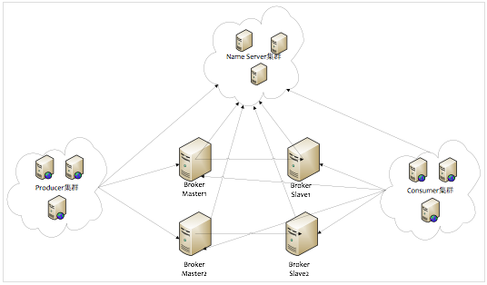
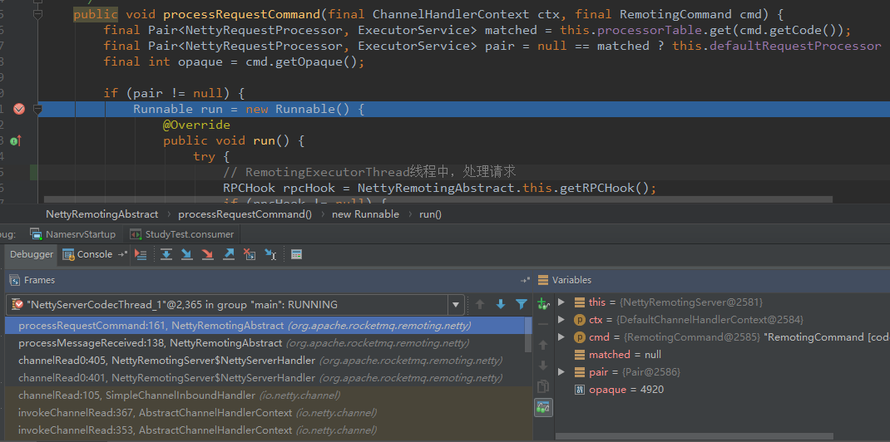

在分析Namesrv之前，首先要知道Namesrv在Rocketmq架构中所处的位置，也就是下图中的Name Server集群。

<!-- more -->



namesrv作为rocketmq的名称服务，是无状态可集群横向扩展的，其提供的功能可归纳为以下几点：
1、broker的注册中心，每个broker启动时向namesrv注册，broker包括master和slave。
2、每个producer发送消息时根据topic从namesrv获取broker信息。
3、每个consumer获取消息时根据topic从namesrv获取broker信息。

Namesrv启动命令为sh bin/mqnamesrv，bin/mqnamesrv文件中启动namesrv的命令如下：
`sh ${ROCKETMQ_HOME}/bin/runserver.sh org.apache.rocketmq.namesrv.NamesrvStartup $@`

从启动命令可以看出Namesrv的启动类是NamesrvStartup（当然使用命令jps -l也能看出），分析namesrv，下面我们就从该类开始。

**NamesrvStartup.main流程：**
1、首先是解析命令行，也就是启动类时传入的args，比如-c 表示使用配置文件(.properties)来初始化namesrv配置类，比如-p表示打印namesrv的启动配置信息。（解析命令行使用commons-cli）
2、初始化logger配置，默认使用{ROCKET_HOME}/conf/logback_namesrv.xml配置文件。
3、创建NamesrvController，并调用其initialize方法，initialize初始化过程如下：
- 加载kvConfig.json至KVConfigManager的configTable，即由持久化加载到内存。
- 创建remotingServer，namesrv作为netty服务启动。
- 创建请求处理线程remotingExecutor，并注册DefaultRequestProcessor和remotingExecutor。等到netty启动后即可处理请求了。
- 向scheduledExecutorService中添加定时任务，用于扫描broker是否过期。

4、注册jvm的ShutdownHook，用于进程退出时清除资源。
5、调用controller.start启动netty服务，也就是启动NettyRomotingServer。
- 创建线程组DefaultEventExecutorGroup，即业务线程组。
- 使用nettyServerConfig配置信息启动ServerBootstrap。
- 添加Timer任务，扫描过期请求，任务间隔1s。

以上就是Namesrv的启动流程，详细信息可直接看源码，下面来看下启动ServerBootstrap部分代码。

```
// controller.start() -> remotingServer.start()
public void start() {
    /**
     * 这个是作为EventExecutorGroup，在ch.pipeline().addList(EventExecutorGroup)时传给netty的,
     * 也就说，在netty的IO处理线程中，会将处理逻辑传递给NettyServerCodecThread，
     * 然后NettyServerCodecThread稍加处理(解码)后传递给namesrv的业务线程，也就是RemotingExecutorThread线程来处理。
     */
    this.defaultEventExecutorGroup = new DefaultEventExecutorGroup(
        nettyServerConfig.getServerWorkerThreads(),
        new ThreadFactory() {
 
            private AtomicInteger threadIndex = new AtomicInteger(0);
 
            @Override
            public Thread newThread(Runnable r) {
                return new Thread(r, "NettyServerCodecThread_" + this.threadIndex.incrementAndGet());
            }
        });
 
    /**
     * eventLoopGroupBoss: listen线程池，selector
     * eventLoopGroupSelector: IO执行线程池，负责读写操作
     * defaultEventExecutorGroup: NettyServerCodecThread 线程池
     */
    ServerBootstrap childHandler =
        this.serverBootstrap.group(this.eventLoopGroupBoss, this.eventLoopGroupSelector)
            .channel(useEpoll() ? EpollServerSocketChannel.class : NioServerSocketChannel.class)
            .option(ChannelOption.SO_BACKLOG, 1024)
            .option(ChannelOption.SO_REUSEADDR, true)
            .option(ChannelOption.SO_KEEPALIVE, false)
            .childOption(ChannelOption.TCP_NODELAY, true)
            .childOption(ChannelOption.SO_SNDBUF, nettyServerConfig.getServerSocketSndBufSize())
            .childOption(ChannelOption.SO_RCVBUF, nettyServerConfig.getServerSocketRcvBufSize())
            .localAddress(new InetSocketAddress(this.nettyServerConfig.getListenPort()))
            .childHandler(new ChannelInitializer<SocketChannel>() {
                @Override
                public void initChannel(SocketChannel ch) throws Exception {
                    ch.pipeline()
                        .addLast(defaultEventExecutorGroup, HANDSHAKE_HANDLER_NAME,
                            new HandshakeHandler(TlsSystemConfig.tlsMode))
                        .addLast(defaultEventExecutorGroup,
                            new NettyEncoder(),
                            new NettyDecoder(),
                            new IdleStateHandler(0, 0, nettyServerConfig.getServerChannelMaxIdleTimeSeconds()),
                            new NettyConnectManageHandler(),
                            new NettyServerHandler()
                        );
                }
            });
 
    if (nettyServerConfig.isServerPooledByteBufAllocatorEnable()) {
        childHandler.childOption(ChannelOption.ALLOCATOR, PooledByteBufAllocator.DEFAULT);
    }
 
    try {
        // bind/listen 开始服务
        ChannelFuture sync = this.serverBootstrap.bind().sync();
        InetSocketAddress addr = (InetSocketAddress) sync.channel().localAddress();
        this.port = addr.getPort();
    } catch (InterruptedException e1) {
        throw new RuntimeException("this.serverBootstrap.bind().sync() InterruptedException", e1);
    }
 
    if (this.channelEventListener != null) {
        this.nettyEventExecutor.start();
    }
 
    this.timer.scheduleAtFixedRate(new TimerTask() {
 
        @Override
        public void run() {
            try {
                NettyRemotingServer.this.scanResponseTable();
            } catch (Throwable e) {
                log.error("scanResponseTable exception", e);
            }
        }
    }, 1000 * 3, 1000);
}
```

从ServerBootstrap初始化参数来看，请求到来时，首先会到达eventLoopGroupSelector中，然后到达defaultEventExecutorGroup中的NettyDecoder进行消息解码：

```
public Object decode(ChannelHandlerContext ctx, ByteBuf in) throws Exception {
    System.out.println("decode: " + Thread.currentThread().getName());
    ByteBuf frame = null;
    try {
        frame = (ByteBuf) super.decode(ctx, in);
        if (null == frame) {
            return null;
        }
 
        ByteBuffer byteBuffer = frame.nioBuffer();
        return RemotingCommand.decode(byteBuffer);
    } catch (Exception e) {
        log.error("decode exception, " + RemotingHelper.parseChannelRemoteAddr(ctx.channel()), e);
        RemotingUtil.closeChannel(ctx.channel());
    } finally {
        if (null != frame) {
            frame.release();
        }
    }
 
    return null;
}
```

解码之后消息流转到NettyServerHandler.channelRead0，在processRequestCommand中会针对cmd code查找对应的requestProcessor和executorService，然后submit给对应的executorService。



```
// channelRead0 -> processMessageReceived -> processRequestCommand
public void processRequestCommand(final ChannelHandlerContext ctx, final RemotingCommand cmd) {
    /**
     * processorTable 针对cmd code自定义的处理器，如果该cmd code没有自定义处理器，则使用defaultRequestProcessor
     */
    final Pair<NettyRequestProcessor, ExecutorService> matched = this.processorTable.get(cmd.getCode());
    final Pair<NettyRequestProcessor, ExecutorService> pair = null == matched ? this.defaultRequestProcessor : matched;
    final int opaque = cmd.getOpaque();
 
    // 任务，submit给RemotingExecutorThread线程的
    Runnable run = new Runnable() {
        @Override
        public void run() {
            try {
                // RemotingExecutorThread线程中，处理请求
                RPCHook rpcHook = NettyRemotingAbstract.this.getRPCHook();
                if (rpcHook != null) {
                    rpcHook.doBeforeRequest(RemotingHelper.parseChannelRemoteAddr(ctx.channel()), cmd);
                }
 
                final RemotingCommand response = pair.getObject1().processRequest(ctx, cmd);
                if (rpcHook != null) {
                    rpcHook.doAfterResponse(RemotingHelper.parseChannelRemoteAddr(ctx.channel()), cmd, response);
                }
 
                if (!cmd.isOnewayRPC()) {
                    if (response != null) {
                        response.setOpaque(opaque);
                        response.markResponseType();
                        try {
                            ctx.writeAndFlush(response);
                        } catch (Throwable e) {
                            log.error("process request over, but response failed", e);
                            log.error(cmd.toString());
                            log.error(response.toString());
                        }
                    } else {
 
                    }
                }
            } catch (Throwable e) {
                log.error("process request exception", e);
                log.error(cmd.toString());
 
                if (!cmd.isOnewayRPC()) {
                    final RemotingCommand response = RemotingCommand.createResponseCommand(RemotingSysResponseCode.SYSTEM_ERROR,
                        RemotingHelper.exceptionSimpleDesc(e));
                    response.setOpaque(opaque);
                    ctx.writeAndFlush(response);
                }
            }
        }
    };
 
    if (pair.getObject1().rejectRequest()) {
        final RemotingCommand response = RemotingCommand.createResponseCommand(RemotingSysResponseCode.SYSTEM_BUSY,
            "[REJECTREQUEST]system busy, start flow control for a while");
        response.setOpaque(opaque);
        ctx.writeAndFlush(response);
        return;
    }
 
    try {
        // 任务提交
        final RequestTask requestTask = new RequestTask(run, ctx.channel(), cmd);
        pair.getObject2().submit(requestTask);
    } catch (RejectedExecutionException e) {
        // ...
    }
}
```


将消息submit给cmd code对应的executorService后，就进入到了上面代码中的Runnable方法，在Runnable方法中传递给requestProcessor来处理。以cmd code为GET_ROUTEINTO_BY_TOPIC为例，该request是在Consumer端启动与Namesrv建立连接后请求routerInfo的，因为GET_ROUTEINTO_BY_TOPIC没有自定义requestProcessor和executorService，然后它的requestProcessor就是defaultRequestProcessor。

```
// DefaultRequestProcessor
public RemotingCommand processRequest(ChannelHandlerContext ctx,
    RemotingCommand request) throws RemotingCommandException {
    switch (request.getCode()) {
        case RequestCode.PUT_KV_CONFIG:
            return this.putKVConfig(ctx, request);
        case RequestCode.GET_KV_CONFIG:
            return this.getKVConfig(ctx, request);
        case RequestCode.DELETE_KV_CONFIG:
            return this.deleteKVConfig(ctx, request);
        case RequestCode.REGISTER_BROKER:
            Version brokerVersion = MQVersion.value2Version(request.getVersion());
            if (brokerVersion.ordinal() >= MQVersion.Version.V3_0_11.ordinal()) {
                return this.registerBrokerWithFilterServer(ctx, request);
            } else {
                return this.registerBroker(ctx, request);
            }
        case RequestCode.UNREGISTER_BROKER:
            return this.unregisterBroker(ctx, request);
        case RequestCode.GET_ROUTEINTO_BY_TOPIC:
            return this.getRouteInfoByTopic(ctx, request);
        case RequestCode.GET_BROKER_CLUSTER_INFO:
            return this.getBrokerClusterInfo(ctx, request);
        case RequestCode.WIPE_WRITE_PERM_OF_BROKER:
            return this.wipeWritePermOfBroker(ctx, request);
        case RequestCode.GET_ALL_TOPIC_LIST_FROM_NAMESERVER:
            return getAllTopicListFromNameserver(ctx, request);
        case RequestCode.DELETE_TOPIC_IN_NAMESRV:
            return deleteTopicInNamesrv(ctx, request);
        case RequestCode.GET_KVLIST_BY_NAMESPACE:
            return this.getKVListByNamespace(ctx, request);
        case RequestCode.GET_TOPICS_BY_CLUSTER:
            return this.getTopicsByCluster(ctx, request);
        case RequestCode.GET_SYSTEM_TOPIC_LIST_FROM_NS:
            return this.getSystemTopicListFromNs(ctx, request);
        case RequestCode.GET_UNIT_TOPIC_LIST:
            return this.getUnitTopicList(ctx, request);
        case RequestCode.GET_HAS_UNIT_SUB_TOPIC_LIST:
            return this.getHasUnitSubTopicList(ctx, request);
        case RequestCode.GET_HAS_UNIT_SUB_UNUNIT_TOPIC_LIST:
            return this.getHasUnitSubUnUnitTopicList(ctx, request);
        case RequestCode.UPDATE_NAMESRV_CONFIG:
            return this.updateConfig(ctx, request);
        case RequestCode.GET_NAMESRV_CONFIG:
            return this.getConfig(ctx, request);
        default:
            break;
    }
    return null;
}
```

如果是GET_ROUTEINTO_BY_TOPIC请求，则getRouteInfoByTopic获取topic对应的routerInfo，然后返回给Consumer，到这里为止Consumer与Namesrv的GET_ROUTEINTO_BY_TOPIC通信就完成了。

当然，除了Consumer与Namesrv通信之外，还有Broker、Producer与Namesrv通信，它们的通信流程和Consumer的GET_ROUTEINTO_BY_TOPIC通信流程大同小异，这里就不再展开了。

说了网络通信（与Consumer、Prosucer、Broker）的处理流程，这些处理流程最终的数据是保存在哪里的呢？这就不得不提Namesrv的信息仓库：**RouteInfoManager**。

RouteInfoManager是namesrv中一个中的类，其主要属性如下所示：

```
private final ReadWriteLock lock = new ReentrantReadWriteLock();
private final HashMap<String/* topic */, List<QueueData>> topicQueueTable;
private final HashMap<String/* brokerName */, BrokerData> brokerAddrTable;
private final HashMap<String/* clusterName */, Set<String/* brokerName */>> clusterAddrTable;
private final HashMap<String/* brokerAddr */, BrokerLiveInfo> brokerLiveTable;
private final HashMap<String/* brokerAddr */, List<String>/* Filter Server */> filterServerTable;
```

以上属性通过名大致可看出都是保存什么数据的，这里之所以使用非线程安全的HashMap，是因为使用了读写锁来保证。brokerAddrTable和brokerLiveTable都保存的有broker信息，其中前者只保存首次注册的broker信息，后者主要是为了保存心跳的时间戳，用来判断该broker是否在线。其中扫非活跃的broker的方法是scanNotActiveBroker。

```
// 时间间隔2分钟
private final static long BROKER_CHANNEL_EXPIRED_TIME = 1000 * 60 * 2;
public void scanNotActiveBroker() {
    Iterator<Entry<String, BrokerLiveInfo>> it = this.brokerLiveTable.entrySet().iterator();
    while (it.hasNext()) {
        Entry<String, BrokerLiveInfo> next = it.next();
        long last = next.getValue().getLastUpdateTimestamp();
        if ((last + BROKER_CHANNEL_EXPIRED_TIME) < System.currentTimeMillis()) {
            RemotingUtil.closeChannel(next.getValue().getChannel());
            it.remove();
            log.warn("The broker channel expired, {} {}ms", next.getKey(), BROKER_CHANNEL_EXPIRED_TIME);
            this.onChannelDestroy(next.getKey(), next.getValue().getChannel());
        }
    }
}
```

如果2分钟内没有收到broker的心跳信息，则将该broker从brokerLiveTable中移除，并且从brokerAddrTable中也移除该broker，如果该broker是master，则它的所有broker都将被删除。

topicQueueTable存储topic及其queue数据，topicQueueTable的value是QueueData的List，可以看下QueueData中的属性：
```
private String brokerName;  // broker的名称
private int readQueueNums;  // 读队列数量
private int writeQueueNums; // 写队列数量
private int perm;           // 读写权限
private int topicSynFlag;   // 同步复制还是异步复制标记
```

在say bye之前，笔者还是想说，虽然Namesrv代码不多（貌似1K左右），但是还有由多种类型的线程的：

 > 线程种类
- RemotingExecutorThread：namesrv的业务线程，处理namesrv接收到的请求，可能有多个。
- NettyServerCodecThread：这个是作为EventExecutorGroup，在ch.pipeline().addList(EventExecutorGroup)时传给netty的，也就说，在netty的IO处理线程中，会将处理逻辑传递给NettyServerCodecThread，然后NettyServerCodecThread稍加处理(解码)后传递给namesrv的业务线程，也就是RemotingExecutorThread线程来处理。
- NettyServerNIOSelector：Netty的childGroup，也就是IO处理线程，可能有多个。
- NettyBoss：Netty的parentGroup，也就是Accpter线程，可能有多个。
- NSScheduledThread：定时任务线程，扫描broker是否过期等。
- ServerHouseKeepingService：Timer守护线程，定时扫描连接
- NettyEventExecuter：一个线程，监听NettyChannel状态变化来通知ChannelEventListener做相应的动作
  
是时候say bye了，关于Namesrv更多的分析请直接阅读源码或者参考网上Rocketmq文档。