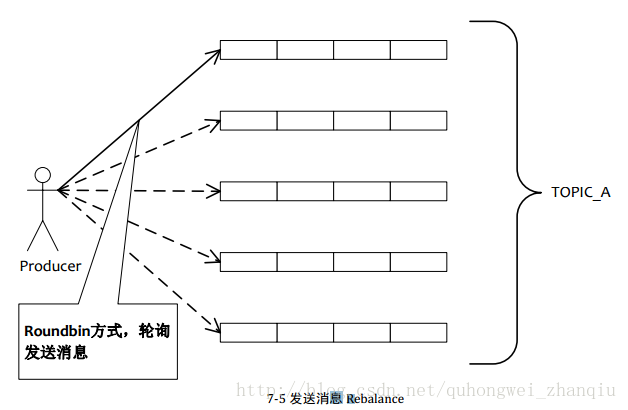
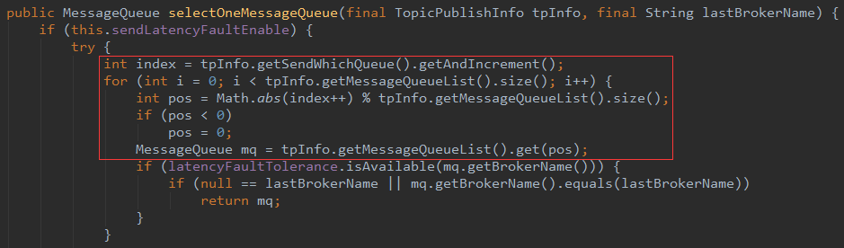
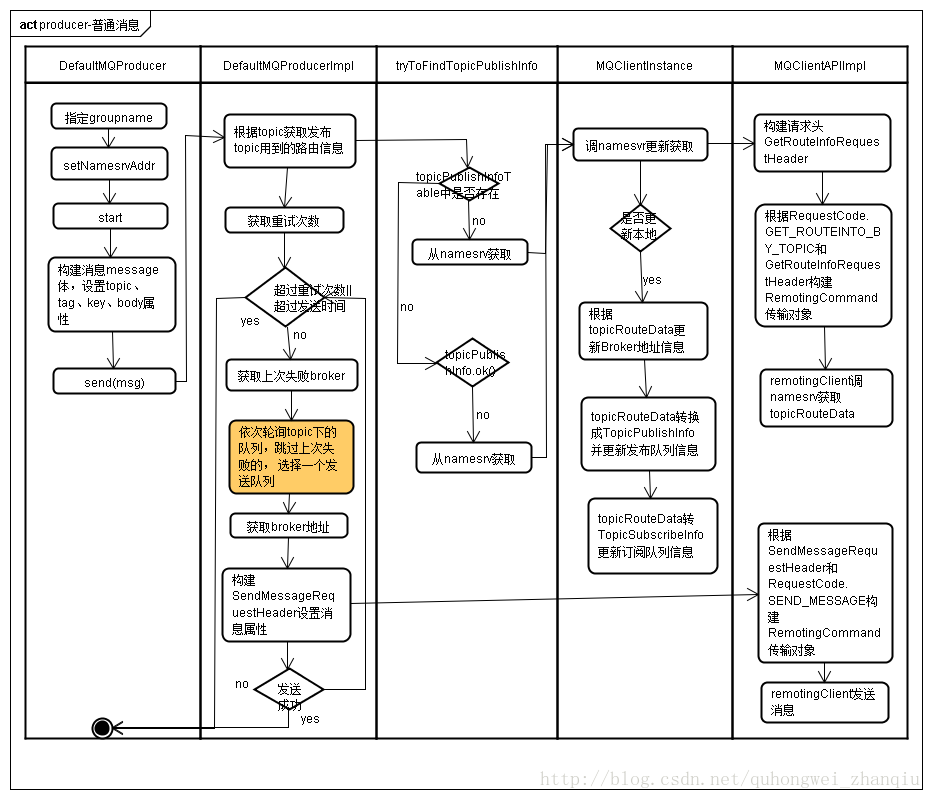

在分析Producer之前，首先要知道Producer在Rocketmq架构中所处的位置，也就是下图中的Producer集群。

<!-- more -->


Producer端，其实只要关注消息的发送就行了（貌似是废话哈，Producer不关注消息发送还关注什么呢）。Producer默认使用轮询topic下所有队列，来实现发送的负载均衡。



topic下队列是可以跨broker的，也就说这些队列可能处于不同的主机上。broker名字相同的是同一组broker，只不过ID为0的是master，其他的为slave。

topic下实现轮询，Producer从namesrv获取的到Topic路由信息TopicPublishInfo，TopicPublishInfo下有topic对应的队列信息List<MessageQueue> messageQueueList，在方法selectOneMessageQueue中会对TopicPublishInfo中的ThreadLocalIndex进行自增，然后取余获取一个队列进行发送。



producer在发送消息失败后，如果是SYNC通信，则会进行重试的1 + this.defaultMQProducer.getRetryTimesWhenSendFailed()次，会找下一个队列继续发送消息；如果是ASYNC通信，则是不会进行重试的。

如果消息发往不存在的topic，则会从namesrv中选择一个broker，然后将消息发往该broker（broker-A），该broker接收到消息后，如果使能新建不存在的topic功能，则会创建该topic，然后会把该topic信息注册到namesrv，这样namesrv就有了刚新建的topic信息了。后续往该topic发送消息就知道该往哪个broker发送了，不过这里需要注意的是，该topic是在broker-A中创建的，其他broker默认是不会创建的，因为之后processor从nameserv中获取的该topic下的broker信息只有broker-A。

producer发送普通消息流程图如下：

（图片来源：[RocketMQ原理解析-producer 2.如何发送消息](http://blog.csdn.net/quhongwei_zhanqiu/article/details/39142077)）

除了同步发送消息之外，还可以异步发送消息，代码示例如下：

```
public void producer() throws Exception {
    DefaultMQProducer producer = new DefaultMQProducer("ProducerGroupName");
    producer.setNamesrvAddr("192.168.2.33:9876");
    producer.setInstanceName("Producer");
    producer.start();
 
    Message message = new Message("topic", ("hello world").getBytes());
    producer.send(message, new SendCallback() {
 
        @Override
        public void onSuccess(SendResult sendResult) {
            System.out.println(Thread.currentThread().getName() + ": onSuccess " + sendResult);
        }
 
        @Override
        public void onException(Throwable e) {
            System.out.println(Thread.currentThread().getName() + ": onException" + e);
        }
    });
 
    producer.shutdown();
}
```

发送异步消息，应用程序在调用send接口后不再等待与broker的网络通信完成就直接返回了，那么什么时候触发SendCallback的呢？先看一下异步发送的逻辑：

```
// NettyRemotingAbstract
public void invokeAsyncImpl(final Channel channel, final RemotingCommand request, final long timeoutMillis,
    final InvokeCallback invokeCallback)
    throws InterruptedException, RemotingTooMuchRequestException, RemotingTimeoutException, RemotingSendRequestException {
     
    // opaque很重要，rocketmq网络通信使用opaque来区分单次网络通信
    final int opaque = request.getOpaque();
    final SemaphoreReleaseOnlyOnce once = new SemaphoreReleaseOnlyOnce(this.semaphoreAsync);
 
    final ResponseFuture responseFuture = new ResponseFuture(opaque, timeoutMillis, invokeCallback, once);
     
    // responseTable 用于存储准备发送消息对应的responseFuture
    this.responseTable.put(opaque, responseFuture);
    try {
        channel.writeAndFlush(request).addListener(new ChannelFutureListener() {
            @Override
            public void operationComplete(ChannelFuture f) throws Exception {
                if (f.isSuccess()) {
                    responseFuture.setSendRequestOK(true);
                    return;
                } else {
                    responseFuture.setSendRequestOK(false);
                }
 
                responseFuture.putResponse(null);
                responseTable.remove(opaque);
                try {
                    executeInvokeCallback(responseFuture);
                } catch (Throwable e) {
                    log.warn("excute callback in writeAndFlush addListener, and callback throw", e);
                } finally {
                    responseFuture.release();
                }
 
                log.warn("send a request command to channel <{}> failed.", RemotingHelper.parseChannelRemoteAddr(channel));
            }
        });
    } catch (Exception e) {
        responseFuture.release();
        log.warn("send a request command to channel <" + RemotingHelper.parseChannelRemoteAddr(channel) + "> Exception", e);
        throw new RemotingSendRequestException(RemotingHelper.parseChannelRemoteAddr(channel), e);
    }
    //...
}
```

消息发送给broker，当该次网络信息，Producer收到Broker的响应时，Netty会触发channelRead方法，最后会走到NettyRemotingAbstract.processResponseCommand方法：

```
// NettyRemotingAbstract
public void processResponseCommand(ChannelHandlerContext ctx, RemotingCommand cmd) {
    final int opaque = cmd.getOpaque();
    final ResponseFuture responseFuture = responseTable.get(opaque);
    if (responseFuture != null) {
        responseFuture.setResponseCommand(cmd);
 
        responseTable.remove(opaque);
 
        if (responseFuture.getInvokeCallback() != null) {
            // 这里会触发，发送消息时自定义的SendCallback
            executeInvokeCallback(responseFuture);
        } else {
            responseFuture.putResponse(cmd);
            responseFuture.release();
        }
    } else {
        log.warn("receive response, but not matched any request, " + RemotingHelper.parseChannelRemoteAddr(ctx.channel()));
        log.warn(cmd.toString());
    }
}
```

普通消息发送OK了，那么如何发送顺序消息呢？rocketmq能够保证消息严格顺序，但是producer需要将顺序消息写入到同一个queue中，如何选择同一个queue呢，需要自定义MessageQueueSelector，代码如下：

```
// RocketMQ通过MessageQueueSelector中实现的算法来确定消息发送到哪一个队列上
// RocketMQ默认提供了两种MessageQueueSelector实现：随机/Hash
// 当然你可以根据业务实现自己的MessageQueueSelector来决定消息按照何种策略发送到消息队列中
SendResult sendResult = producer.send(msg, new MessageQueueSelector() {
    @Override
    public MessageQueue select(List<MessageQueue> mqs, Message msg, Object arg) {
        Integer id = (Integer) arg;
        int index = id % mqs.size();
        return mqs.get(index);
    }
}, orderId);
```
